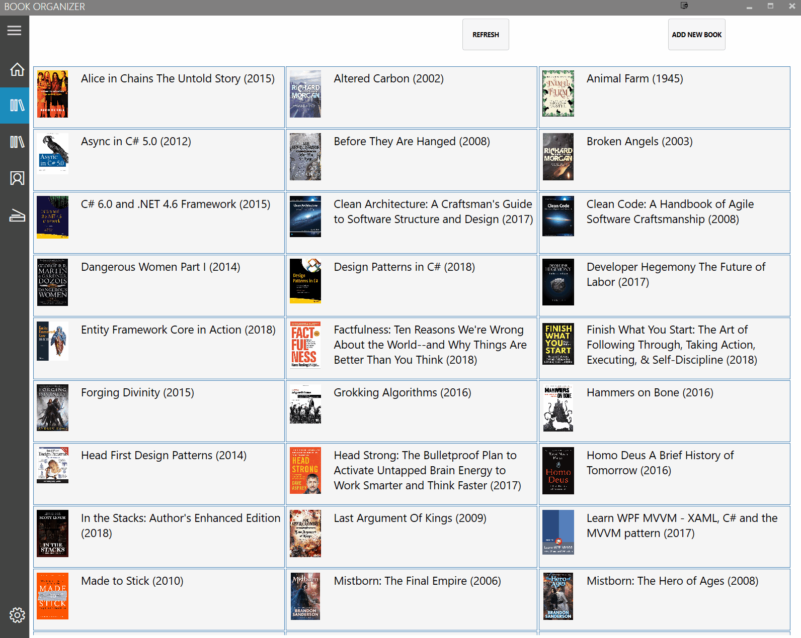

# BookOrganizer
Book Organizer is an application to keep track of the books read and own. Reason behind this was to teach myself to code. That said, it's easy to guess this application is far from perfect.

This first version, let's call it 0.9 as it's still missing some features that I thought to include in the first version and lots of tweaking needed on UI. I used word thought here because not much planning was done before starting to code. That probably can be best seen if someone makes the mistake and looks commit messages.

Book/author/publisher details view:

