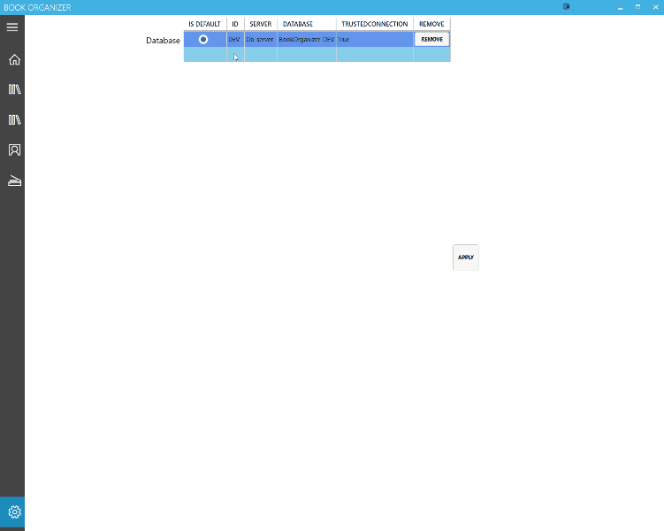

# BookOrganizer
Book Organizer is an application designed to keep track of the books read and own. 

Original reason behind starting this was to teach myself to code.

## UI
At the moment there are two WPF interfaces implemented (.NET Framework 4.7.1 and Core 3.1).

## Persistence
SQL Server is the only DB available currently (EF Core).

## Book Organizser (WPF Core)

## Book Organizer (WPF v.1.0.0.1)
Book/author/publisher details view:

Edit book details:

Edit series:

Add/Remove/Modify database settings:

