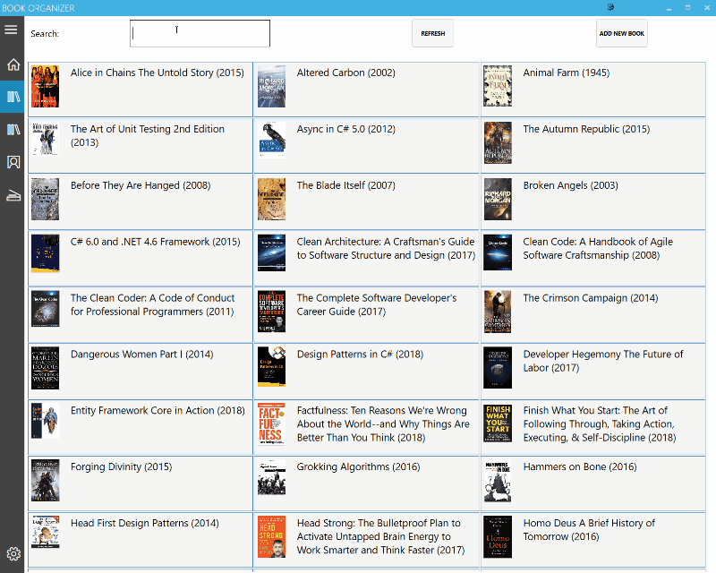

# BookOrganizer
Book Organizer is an application to keep track of the books read and own. Reason behind this was to teach myself to code. That said, it's easy to guess this application is far from perfect.

Book/author/publisher details view:

Edit book details:

Edit series:

Add/Remove/Modify database settings:

